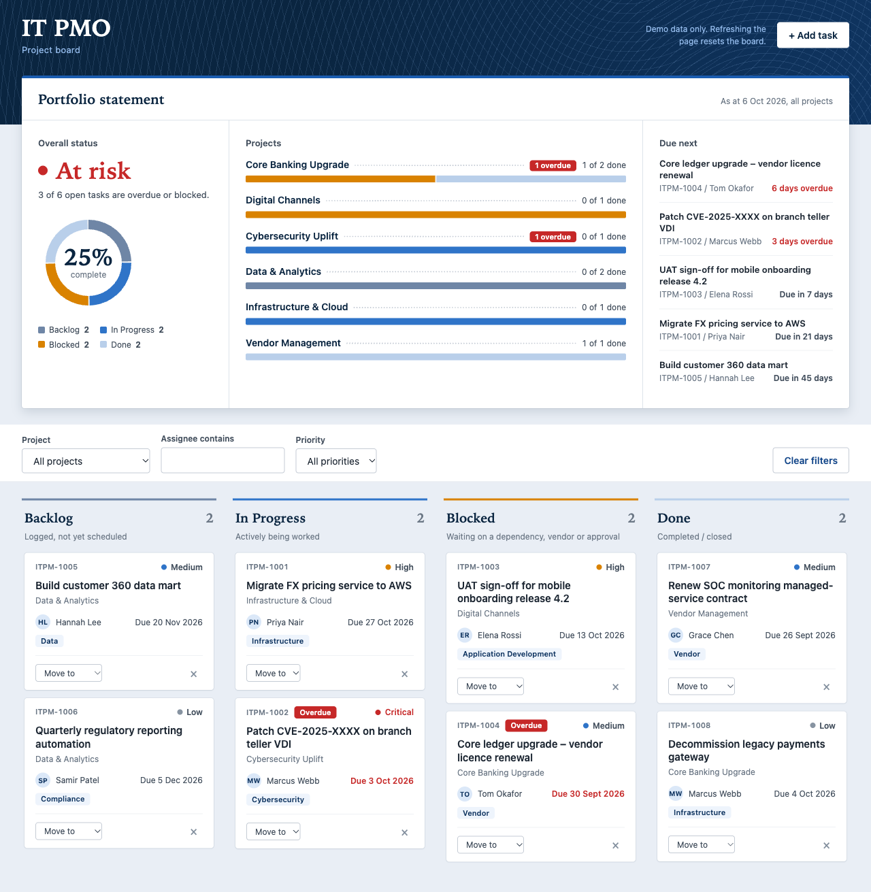

# IT PMO Project Board


A single-file Kanban board for an IT PMO at a fictitious bank. It is an internal demo and training tool.

**Live demo:** https://polarity-i.github.io/claude-training/



## Features

- Four columns: **Backlog**, **In Progress**, **Blocked**, **Done**
- Add, move and delete tasks (move via drag and drop or the per-card "Move" menu; delete uses an inline Yes / No confirmation)
- Filter by project, assignee and priority
- **Portfolio statement** dashboard: an overall verdict (On track, Watch or At risk), a status ring with percent complete, a per-project ledger with status bars and overdue flags, and the next deadlines
- Overdue badge and red due date on late cards
- Email notification for each new task through [FormSubmit](https://formsubmit.co)
- IT Project Briefing popup (Wed 14 Oct 2026, 2pm, Town Hall Meeting Room) shown after 10 seconds on the page; a project hook in `.claude/hooks/` checks it stays intact

## Tech and constraints

- Vanilla HTML, CSS and JavaScript in one file, `index.html`
- No build step, no dependencies, no frameworks
- No external resources (no CDN, web fonts or images)
- No persistence: refreshing the page resets the board to the seed data

## Run locally

```bash
open index.html
```

No server is needed.

## FormSubmit notifications

`FORMSUBMIT_ENDPOINT` at the top of the script is a placeholder. To receive emails, set it to your own address. FormSubmit needs one-time activation: the first submission sends a confirmation link to that address, and deliveries start once it is clicked. Until then, or with the placeholder, the request fails and the board shows a warning toast. This is expected and does not break the board.

## Deployment

A GitHub Actions workflow (`.github/workflows/ci-cd.yml`) validates `index.html` on every push and pull request. On pushes to `main` it deploys the page to GitHub Pages.

## Project structure

```
index.html                       the whole app
docs/screenshot.png              board screenshot used in this README
CLAUDE.md                        project guidance for Claude Code
.github/workflows/ci-cd.yml      CI checks and Pages deployment
.claude/commands/                custom Claude Code commands
```

## Disclaimer

All data is fictitious and the project is for demo and training use only.
